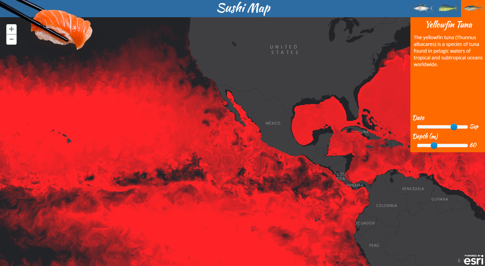

# Sushi Map

Where an where to find three species of tuna. A rough approximation of tuna habital regions based on depth, temperature, salinity and species depth range.

Click here for [live](http://maps.esri.com/rc/sushi2d/index.html) application.

